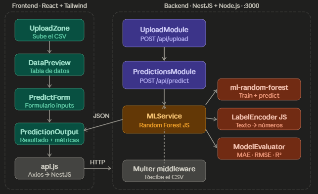

<div align="center">
  
  
  # 🎯 Predicciones - Random Forest Regressor
  
  *Aplicación web full-stack diseñada para predecir el tiempo de entrega de pedidos utilizando Machine Learning en tiempo real.*
</div>

---

## 📖 Descripción del Proyecto

Este sistema calcula de manera automatizada el `TiempoEntregaHoras` basándose en un modelo de **Random Forest Regressor** entrenado directamente en el backend mediante procesamiento de archivos planos. Ideal para optimizar la logística y estimación de tiempos de distribución.

---

## 📐 Arquitectura del Sistema



### 💻 Frontend (React + Tailwind CSS v4)

- **UploadZone**: Interfaz drag-and-drop para subir el CSV con datos históricos.
- **DataPreview**: Vista previa de los primeros 10 registros.
- **PredictForm**: Formulario para las características de un nuevo pedido.
- **PredictionOutput**: Tiempo estimado con indicador visual (Verde &lt; 24h, Amarillo 24–72h, Rojo &gt; 72h).
- **api.js**: Cliente HTTP hacia la API REST del backend.

### ⚙️ Backend (NestJS + TypeScript)

- **UploadModule**: Subida de CSV (`POST /api/upload`).
- **PredictionsModule**: Entrenamiento (`POST /api/predictions/train`) e inferencia (`POST /api/predictions/predict`).
- **PredictionsService**: Label encoding, Random Forest (100 estimadores) y métricas MAE, RMSE y R².

---

## 🛠️ Stack Tecnológico

<div align="center">

| Componente | Tecnologías Utilizadas |
| :--- | :--- |
| **Backend** | NestJS • Node.js • TypeScript • `ml-random-forest` • `papaparse` |
| **Frontend** | React • Vite • Tailwind CSS v4 |

</div>

---

## 🚀 Instalación y Ejecución

### ⚙️ 1. Backend

```bash
cd backend
npm install
npm run start
```

El servidor corre en el puerto **3000**.

### 💻 2. Frontend

En otra terminal:

```bash
cd frontend
npm install
npm run dev
```

Abre [http://localhost:5173](http://localhost:5173).

### 3. Modo producción (local)

Un solo servidor sirve la API y el frontend compilado:

```bash
npm install --prefix frontend
npm install --prefix backend
npm run build
```

En PowerShell:

```powershell
$env:NODE_ENV="production"
npm run start:prod --prefix backend
```

Abre [http://localhost:3000](http://localhost:3000).

---

## 🌐 Despliegue en Render

El repositorio incluye `render.yaml` para desplegar **API + frontend** en un solo servicio.

1. Repositorio: [https://github.com/MarcoEC2414/Predicciones](https://github.com/MarcoEC2414/Predicciones)
2. En [Render](https://render.com) → **New** → **Blueprint** → conecta el repo.
3. Render detectará `render.yaml`, construirá el proyecto y publicará la URL pública.

Variables opcionales:

| Variable | Uso |
|----------|-----|
| `FRONTEND_URL` | Orígenes CORS separados por coma si el frontend está en otro dominio |
| `VITE_API_URL` | Solo si el frontend se compila aparte apuntando al backend |

Alternativa Docker:

```bash
docker build -t predicciones .
docker run -p 3000:3000 -e NODE_ENV=production predicciones
```

---

## 📊 Dataset de Prueba

Se incluye `datos_pedido.csv` en la raíz con 50 registros realistas.

**Variables de entrada:** DistanciaKm, CantidadCajas, Peso (Kg), Tipo Vehiculo, tiempos operativos, TipoProducto, Zona, DiaSemana, HoraPedido, ClienteRecurrente.

**Variable objetivo:** `TiempoEntregaHoras`.
